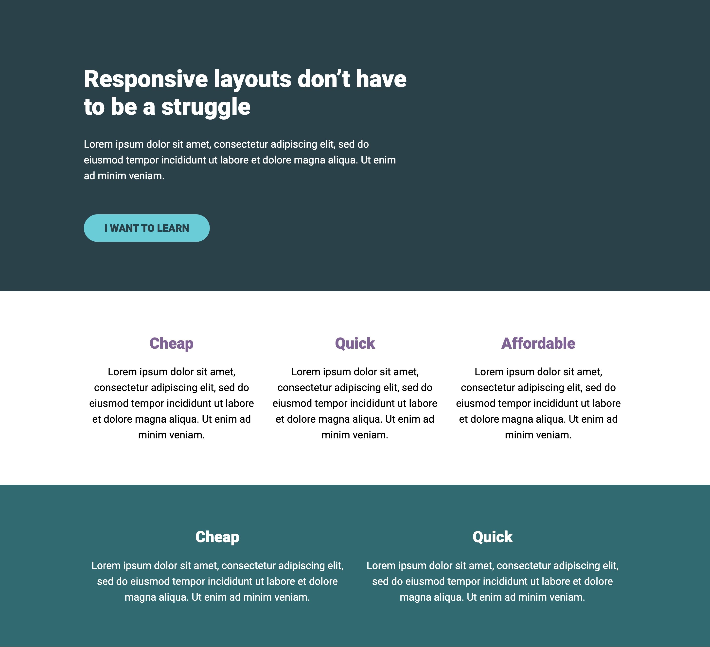

# Conquering Responsive Layout | Challenge #3

This challenge is part of the conquering responsive design by Kevin Powell.

## Live Preview
https://jmg002050.github.io/Responsive-layout-03/

## 📸 Preview

## Features
* Responsive layout 

## Built With
* HTML5
* CSS3
* Mobile-First Design Principles

## What I Learned

While building this project, I practiced:

* How we can center various elements
* Positioning elements relative to one another
* Structuring HTML for maintainability and readability

## Challenges

One of the biggest challenges is how these challenges are more desktop first approach as I am used to mobile design first 
Understanding new concepts as sometimes there is not much explanation about the reason of why some things may be better design

## Future Improvements

* Adding some interactivity for the button
* Expanding the site with more elements
* Make it more mobile friendly 

## Acknowledgements

Challenge provided by Kevin powell, Conquering Responsive Design.

## Author

Jorge Martinez

* [GitHub: https://github.com/yourusername](https://github.com/JMG002050)
* Kevin Powell: https://courses.kevinpowell.co/
